## Prueba de concepto 1

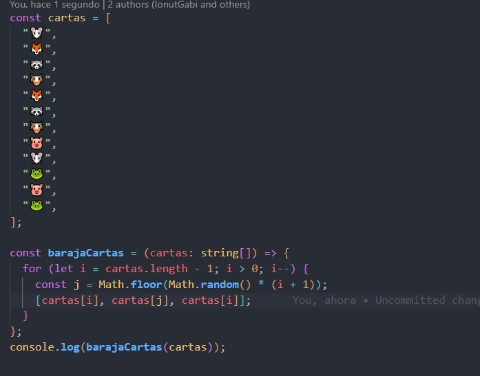

En esta prueba he creado, primero un array de emojis, luego me cree el método barajaCartas que como se puede observar contiene un algoritmo que nos desordena el array cartas, como nos pedía la propia prueba

## Prueba de concepto 2

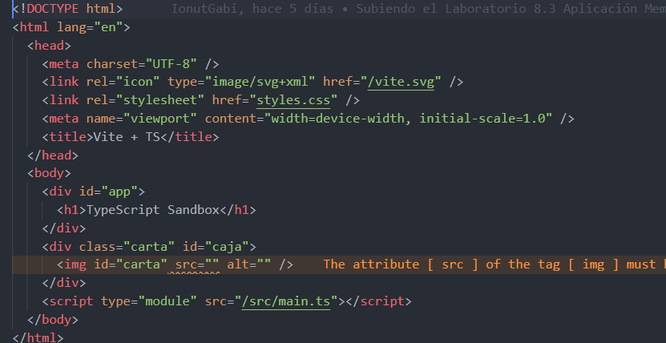

El primer archivo que vamos a modificar es el HTML, le vamos a añadir un div con la clase **_carta_** y un id llamado **_caja_**
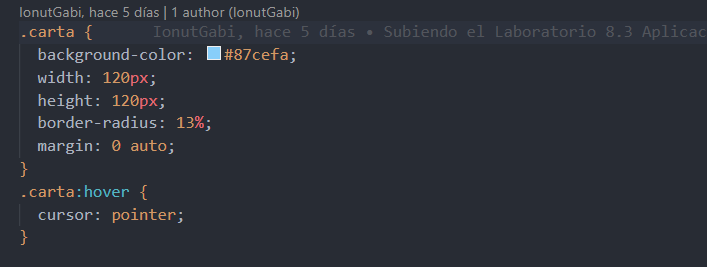
Luego hemos creado un archivo **_styles.css_** para aplicarle un poco de estilo al div, como un color de fondo, un ancho un alto y un borde redondeado, también lo hemos centrado

Aparte también al mismo div le hemos añadido el efecto hover, que cuando el usuario pase por encima el puntero del ratón, este se convierta en una mano cuando va a pulsarlo
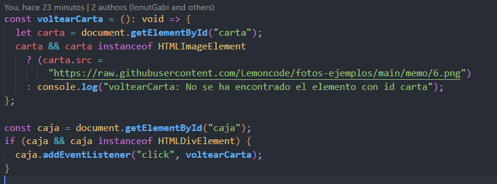
Ahora pasamos al fichero **_main.ts_** en donde he creado un método llamado **_VoltearCarta_**, lo que hace este método es cambiar el atributo de **_src_** de la constante **_carta_** en donde hemos guardado el id de la etiqueta **_img_**. Luego creamos otra constante llamada **_caja_** en donde guardaremos el id que tiene la etiqueta div del HTML, y le añadimmos un evento click para que cuando se pulse cambié el **_src_** de la imagen

## Prueba de concepto 3

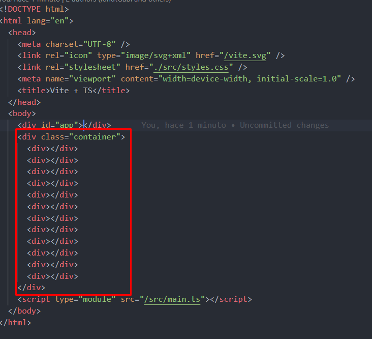
Lo primero que tenemos que hacer es crear 12 divs en nuestro HTML

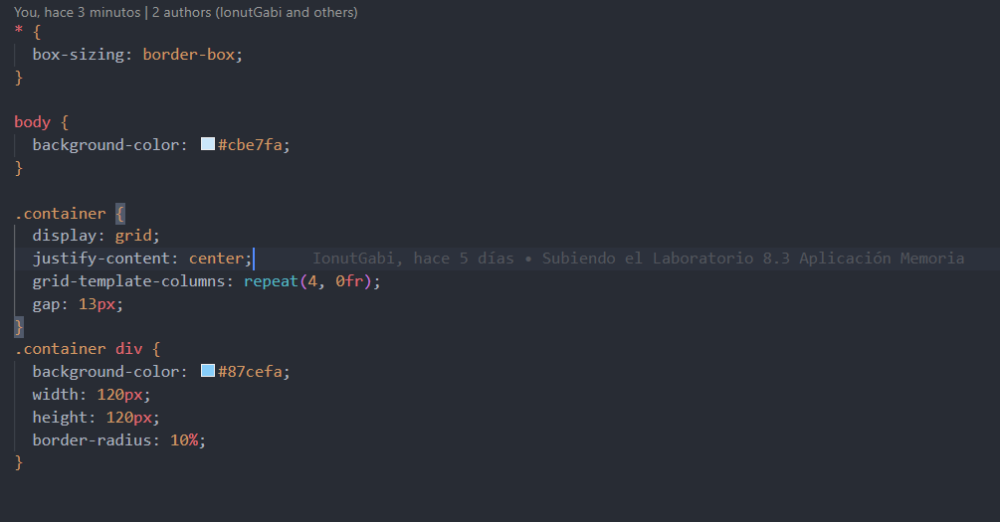
Lo siguiente que haremos será crear el archivo **_styles.css_**, dentro hemos utilizado la clase **_container_** de la etiqueta **_div_** que contiene los 12 divs, y le hemos aplicado CSS Grid. Luego de la misma clase hemos utilizado los divs que contenia para aplicarles un color de fondo azul claro, un ancho un alto y un borde redondeado del 10%

## Prueba de concepto 4

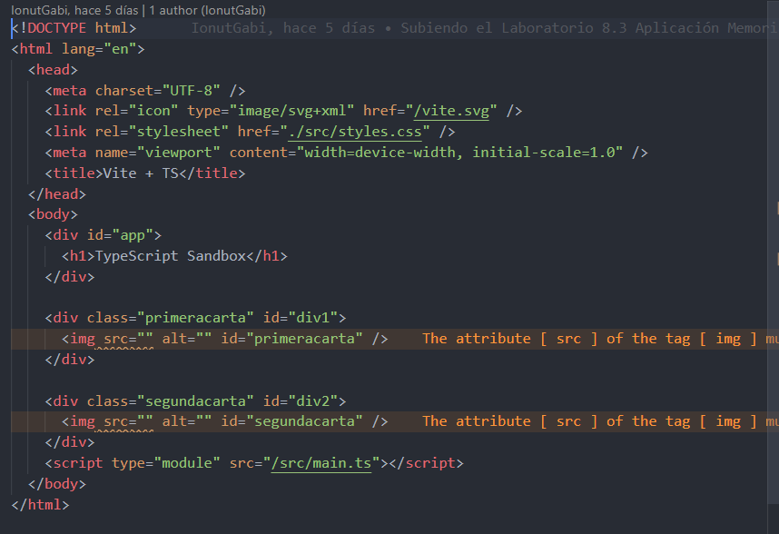
En el HTML creamos dos divs, uno con la clase **_primeracarta_** y el otro con la clase **_segundacarta_** dentro de los divs metemos la etiqueta **_img_** y añadimos el mismo nombre de las clases al atributo **_id_**
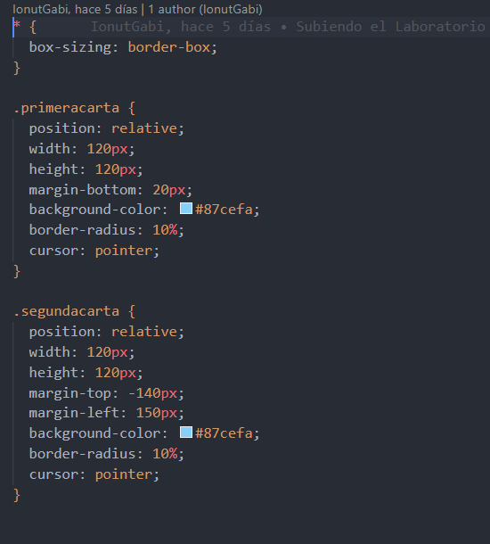

Creamos un archivo **_styles.css_** para darle estilos a nuestras cartas, dentro estilizamos el primer div posición relativa, ancho y alto, margen por abajo, un color de fondo, un borde redondeado y la propiedad **_cursor_** y hacemos lo mismo con la clase **_segundacarta_**
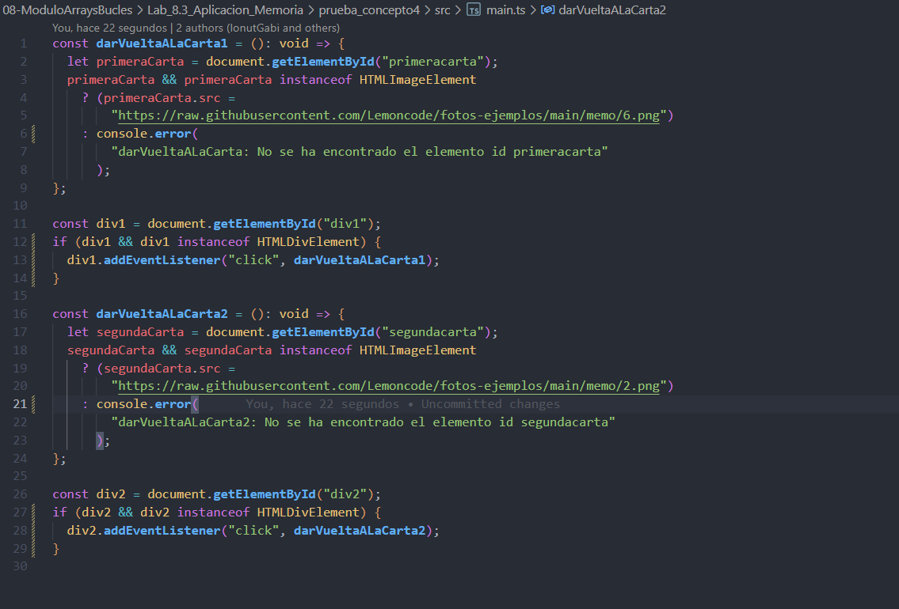
Por último, creamos el tercer archivo el **_main.ts_** y dentro hacemos que las cartas se den la vuelta, para hacerlo recogemos en dos constantes los dos id de los dos divs y con el evento click llamamos a los dos métodos necesarios, que los hemos llamado **_darLaVueltaALaCarta1_** y **_darLaVueltaALaCarta2_** en donde cambiamos el src de la imagen

## Prueba de concepto 5

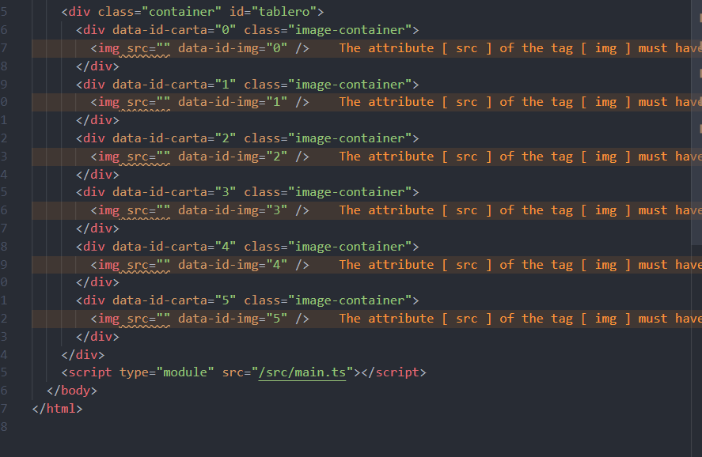
En está prueba de concepto lo que vamos a hacer es crear varios divs, un div contenedor con la clase **_container_** y el id **_tablero_** y luego, dentro de este div iremos creando más divs con el atributo **_data-id-carta_** y la clase **_image-container_** También dentro de cada div vamos a crear una etiqueta **img** también con un atributo, llamado **_data-id-img_**. Como valor en los dos atributos vamos a colocar el mismo número. Como aparece en la captura
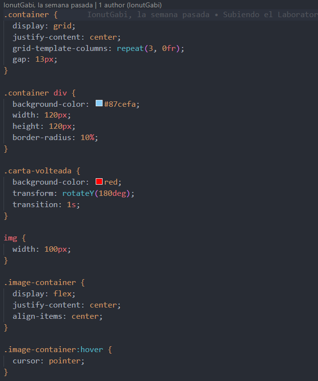
En el CSS, a la clase **_container_** le vamos a decir que sea Grid, que el contenido, este centrado, también le vamos a decir que las columnas se repitan 3 veces y que tenga un **_gap_** de **13px**. Seguimos utilizado la clase **_container_** pero ahora le decimos que queremos todos los divs que contiene, a estos les vamos a poner un color de fondo azul claro un ancho y un alto de **120px** y un **_border-radius_** del **10%**.
Luego de hacer todo lo anterior creamos otra clase llamada **_carta-volteada_** con un color de fondo **rojo**, la propiedad **_transform_** con una rotación de **180 grados** en el eje vertical y una **_transición_** de un **1s**. A la etiqueta **_img_** le ponemos un ancho de **100px**.
La siguiente clase es **_image-container_** a está clase le decimos que sea **_display flex_**, y que este **centrado** tanto horizontalmente como verticalmente. Y por último añadiremos el efecto **hover** para cuando se pase el cursor por encima se convierta en un puntero.
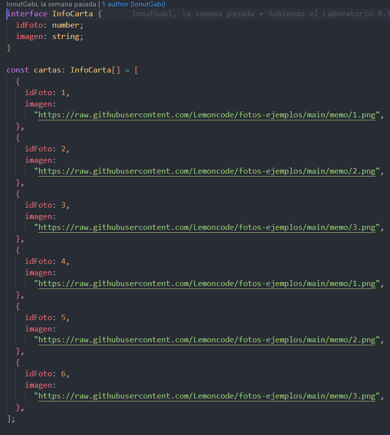
En el archivo main.ts, primero vamos a crear un interfaz llamada InfoCarta, que va a tener como atributos el idFoto y la imagen cada uno con su tipo correspondiente, una vez hecho eso, crearemos el array de cartas en base a la interfaz creada anteriormente.
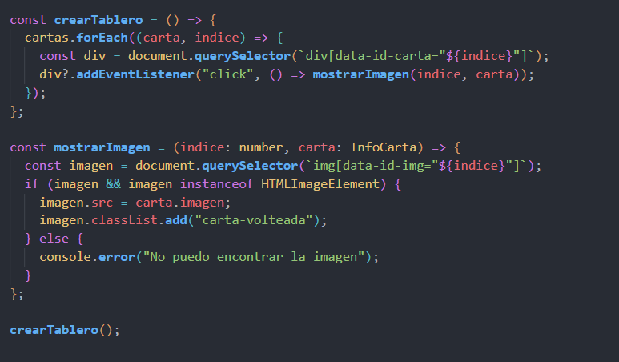
Luego de haber creado el array, nos creamos un método llamado **_crearTablero_** en donde, con el array method **forEach** recorreremos el array de cartas, pillamos el atributo **_data-id-carta_** le pasamos el **indice** y luego creamos un evento en donde cuando se pulse en la carta este método llamará a otro, que lo hemos llamado **_mostrarImagen_**.
Al método **_mostrarImagen_** le pasamos indice y la carta por parámetro y este se encarga de pillar el atributo de la imagen en donde le pasamos tmabién el **indice** haciendo intercalación. Con esto vamos a mapear la carta que se va pulsar y le cambiamos el atributo **src** y adicionalmente, le añadiremos la clase **_carta-volteada_** que hemos definido en el archivo **_styles.css_**.
Por último, llamaremos a la función de **_crearTablero_** al final del **_main.ts_**
